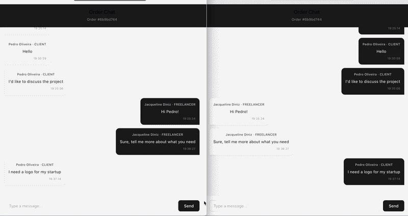
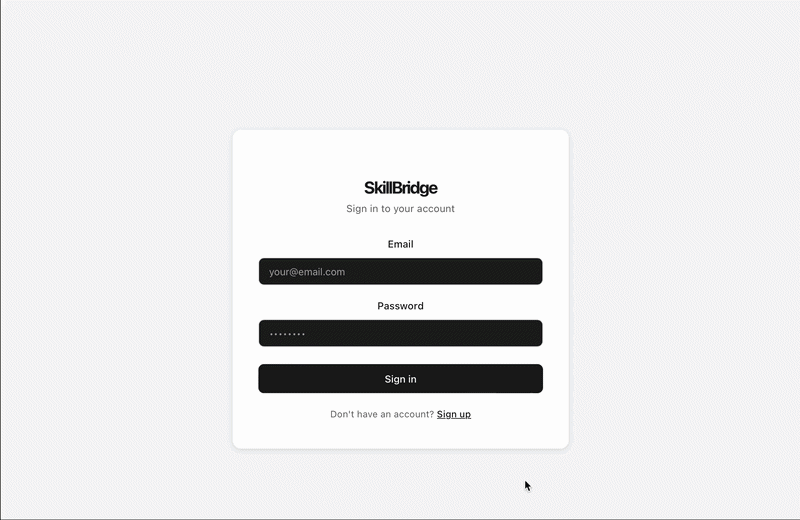

# SkillBridge


A full-stack marketplace platform connecting freelancers and clients. Built as a portfolio project to demonstrate real-world development skills.

🌐 **Live Demo:** [skillbridge-gamma.vercel.app](https://skillbridge-gamma.vercel.app)

---

## Demo

### Browsing and hiring services


### Real-time chat


### Dashboard and order management


---

## Features

- JWT authentication with bcrypt password hashing
- Role-based access control — freelancers and clients have different permissions
- Freelancers can create, edit and delete services
- Clients can browse, filter and hire services
- Real-time chat with Socket.io — messages delivered instantly
- Order management with status tracking (Pending → In Progress → Completed)
- Dashboard with live metrics — earnings, active orders and completed orders

---

## Tech Stack

**Front-end**
- React + Vite
- React Router DOM
- Axios
- Socket.io Client
- Context API for global state

**Back-end**
- Node.js + Express
- Prisma ORM
- PostgreSQL
- JWT + bcrypt
- Socket.io

**Deploy**
- Front-end: Vercel
- Back-end: Render
- Database: Railway (PostgreSQL)

---

## Technical Challenges

- Migrating from SQLite (development) to PostgreSQL (production) using Prisma migrations
- Implementing real-time bidirectional communication with Socket.io and WebSocket
- Role-based access control for freelancers and clients with JWT middleware
- Managing global authentication state with React Context API
- Configuring CORS for cross-origin requests between Vercel and Render

---

## Getting Started

### Prerequisites
- Node.js 20+
- Git

### Clone the repository
```bash
git clone https://github.com/jacquelinediniz/skillbridge.git
cd skillbridge
```

### Run the back-end
```bash
cd server
npm install
cp .env.example .env
# Fill in the .env variables
npx prisma migrate dev
npm run dev
```

### Run the front-end
```bash
cd client
npm install
npm run dev
```

---

## Environment Variables

### server/.env
```
DATABASE_URL="postgresql://..."
JWT_SECRET="your_secret_key"
PORT=3000
```

### client/.env
```
VITE_API_URL="http://localhost:3000"
```

---

## Project Structure
```
skillbridge/
├── server/
│   ├── src/
│   │   ├── controllers/
│   │   │   ├── auth.controller.js
│   │   │   ├── service.controller.js
│   │   │   ├── order.controller.js
│   │   │   └── message.controller.js
│   │   ├── routes/
│   │   │   ├── auth.routes.js
│   │   │   ├── service.routes.js
│   │   │   ├── order.routes.js
│   │   │   └── message.routes.js
│   │   ├── middlewares/
│   │   │   └── auth.middleware.js
│   │   └── config/
│   │       ├── prisma.js
│   │       └── socket.js
│   └── prisma/
│       └── schema.prisma
└── client/
    └── src/
        ├── pages/
        │   ├── Home/
        │   ├── Login/
        │   ├── Register/
        │   ├── Dashboard/
        │   ├── Orders/
        │   ├── Chat/
        │   └── Services/
        ├── components/
        ├── services/
        │   └── api.js
        └── contexts/
            └── AuthContext.jsx
```

---

## Roadmap

- [ ] Payment integration with Stripe
- [ ] Service ratings and reviews
- [ ] Email notifications with Nodemailer
- [ ] Search with filters by price range
- [ ] Mobile app with React Native

---

## Author

Jacqueline Diniz — [github.com/jacquelinediniz](https://github.com/jacquelinediniz)

---

## License

MIT